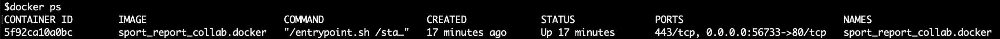
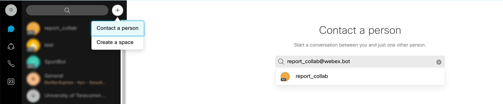
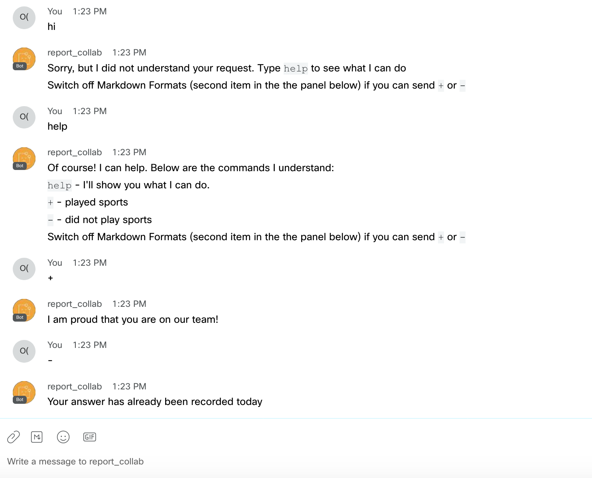
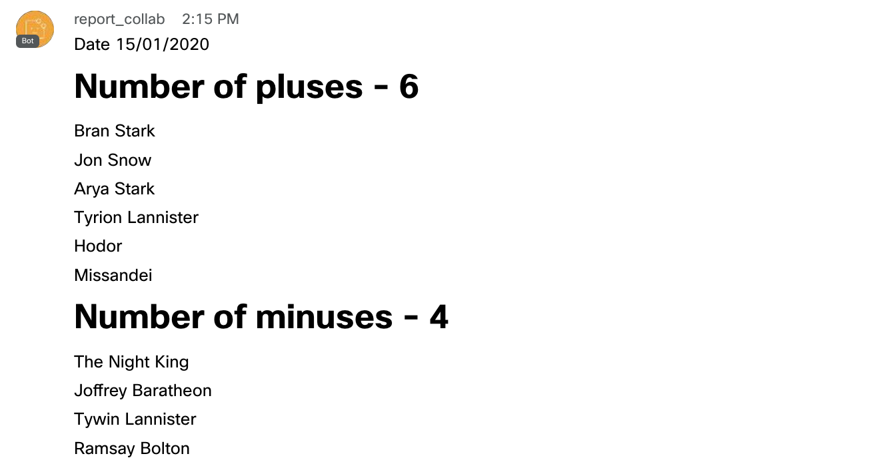

# Report collab bot

Report collab bot - the app that uses Webex Bot to collect and process answers from users.

- [x] collect and count the user's activities with a bot. For example daily task report etc
- [x] sent motivated sentence as a response on user answer
- [x] aggregate and submit daily reports to the appropriate user (or user list)
- [x] make you happy
- [ ] work with image recognition (you can choose your own module, links, and information here)

For which purpose you can use it:
- for daily monitoring users activities (sports activities, employee daily task)
- motivate users to make some task using technologies

### Requirements
- [Python](https://www.python.org/downloads/)
- [Docker](https://www.docker.com/get-started)

### Installation

**1. Clone and open project**

```
git clone https://github.com/oborys/report_collab_bot
cd report_collab_bot
```
**2. Open files [app/views.py](app/views.py) and [Dockerfile](Dockerfile)**

**3. Create a Webex bot and Webhook**

Create Webex Bot:
- [Sign-up](https://www.webex.com/pricing/free-trial.html) or [Sign-in](https://teams.webex.com/signin) in Webex Teams
- Go to [https://developer.webex.com/](https://developer.webex.com/), then click [My Apps](https://developer.webex.com/my-apps) and click Create a Bot

Copy Bot's Access Token


**Paste it into the file [app/views.py](app/views.py) variable `bearer`**


For sent information to your server/localhost, create [Webhook](https://developer.cisco.com/learning/tracks/devnet-express-cloud-collab-it-pro/creating-spark-bots-itp/collab-spark-botl-itp/step/4)

For testing on localhost, you can use [ngrok](https://ngrok.com/download)
After installing ngrok open **new terminal window** and run the command
```
ngrok http 56733
```


####Do not close this terminal window, since the app needs it to redirect webhooks to your localhost.

**Сopy and paste url in file [app/views.py](app/views.py) variable `webhookUrl`**

**4. Next, you need to edit this variable `reportPeopleEmailList`** 

You can insert their email addresses of Webex users who will receive a daily report with an aggregated statistic from the bot.
Add at least one email address.

**5. Set daily report time**

`reportTime = '20:00'`

> If you run the app at 15:14 bot report will be sent at 20:14


**6. Set your time zone in [Dockerfile](Dockerfile)**

By default, timezone is Europe/Kyiv

**After completing all the above points, we can build a container**

Run docker container on port 56733
```
bash start.sh
```

Check app availability on your server http://ip-address:56733 or http://localhost:56733

For checking docker container you can use next CLI command

```
docker ps
```


Running the next command you can see information about container logs, also monitor all output information from the Python app. And command like print, logging.debug, logging.info, logging.warning.   

```
docker logs [CONTAINER ID]
```
If you edit code files or requirements.txt, run next commands to apply changes
```
sudo docker stop sport_report_collab.docker && sudo docker start sport_report_collab.docker
```

Remove the docker container. In case if you got some critical errors, or edit your `Dockerfile` or `uwsgi.ini`
```
docker rm -f [CONTAINER ID]
```
### Interaction with bot

Find a bot to interact with

Enter the email of bot that you create




Interaction with bot



Sample of daily report



### How it's works

Users, in the time interval (24h), can send message to the bot:
`+/-` or `done/unfinished` or `yep/nope`
by default: `+/-`

Get motivated response sentence like "You do great!", "Bad Training Is Devastating".
by default: bot response is adapted for sport exercise
and stored in files:

`sentence_done.txt`

`sentence_unfinished.txt`

You can edit this file and add in there your custom responses.

> Each response should be in a new line. The code detects the Unix system's newlines (\n) symbol as a line delineator.
  
The main part of the code is stored in `app/views.py`

At the end of source code, you can find a scheduler
```
sched = BackgroundScheduler(daemon=True)
sched.add_job(sendStatistic, 'interval', minutes=60)
sched.start()
```
When you want to quickly test and debug your changes you can change variable `minutes` from `60` to `1` minute


### Image recognition

Users can interact with bot by sending a photo, using a smartphone/laptop camera.
For this scenario, you can add Image recognition and count it as a user response.
In sport case: you can add your custom module that can detect whether the user is dressed in a sports uniform or not. 
This feature needs to be tested on your production environment

Which libraries and project I suggest to use:
- [https://js.tensorflow.org/api/1.7.2/](https://js.tensorflow.org/api/1.7.2/)
- [https://github.com/justadudewhohacks/face-api.js/](https://github.com/justadudewhohacks/face-api.js/)
- [https://github.com/tensorflow/tfjs-models/tree/master/body-pix](https://github.com/tensorflow/tfjs-models/tree/master/body-pix)


**Other Useful links**

- [How To Build and Deploy a Flask Application Using Docker on Ubuntu 18.04](https://www.digitalocean.com/community/tutorials/how-to-build-and-deploy-a-flask-application-using-docker-on-ubuntu-18-04)
